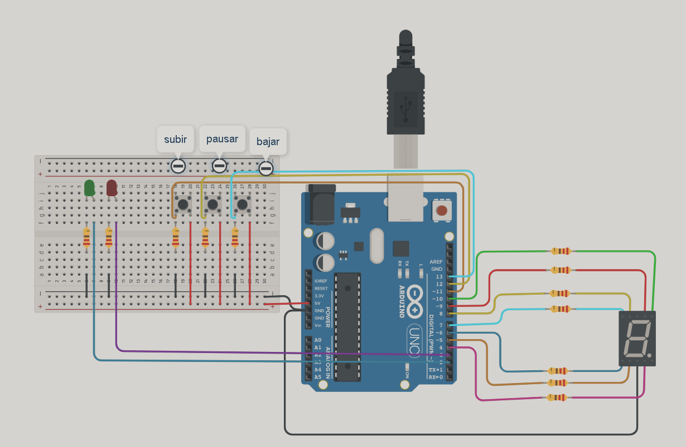
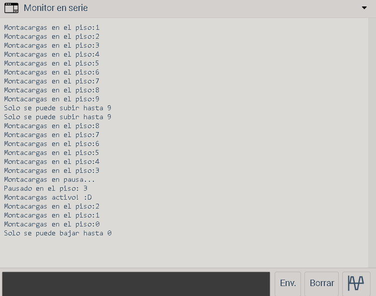
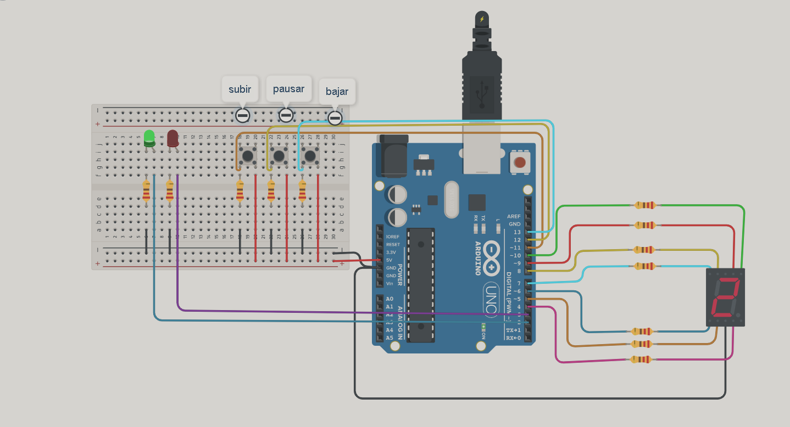
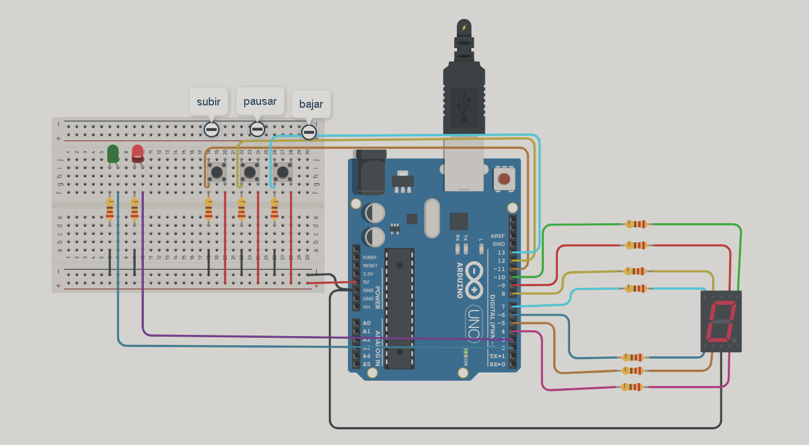

# Parcial1_spd_2023
<h2> Proyecto : Montacargas</h2>
<br>
<h2> Descripción</h2>
<p>EL proyecto es un modelo de montacargas que recibe ordenes de subir, bajar o pausar
desde diferentes pisos y muestre el estado actual del montacargas en el display 7 segmentos.</p>
<h2> Funcionamiento</h2>
<p>Se definen los pines utilizados para los pulsadores, los LEDs y los segmentos del display mediante #define. Por ejemplo, PULSADOR_BAJAR se define como el pin 13.

Se declaran variables para almacenar los estados de los pulsadores y los estados anteriores de los pulsadores. También se declara la variable estadoDelLed para almacenar el estado del LED rojo y la variable nivel para almacenar el nivel del montacargas.

Se declaran dos arreglos: elementos[] para almacenar los pines de los segmentos del display de siete segmentos y pulsadores[] para almacenar los pines de los pulsadores.

En la función setup(), se configuran los pines como entrada o salida utilizando la función pinMode(). Los pines de los segmentos del display se configuran como salidas, mientras que los pines de los pulsadores se configuran como entradas. Además, se inicia la comunicación serial a una velocidad de 9600 baudios y se llama a la función visualizacion() para mostrar el número 0 en el display.

En la función loop(), se realiza el control del montacargas y la detección de los pulsadores.

Primero, se lee el estado del pulsador de subir (PULSADOR_SUBIR) y se compara con el estado anterior (estadoAnteriorBotonSubir). Si hay un cambio en el estado del pulsador y el flag de pausa (flagPausa) es falso, se llama a la función subirMontacargas().

A continuación, se realiza lo mismo para el pulsador de bajar (PULSADOR_BAJAR) y se llama a la función bajarMontacargas() si hay un cambio de estado.

Luego, se lee el estado del pulsador de pausar (PULSADOR_PAUSAR) y se compara con el estado anterior (estadoAnteriorBotonPausar). Si el pulsador está presionado y el estado anterior está en bajo, se cambia el estado del LED verde (LED_VERDE) y se llama a la función pausarMontacargas() con el estado del LED como argumento. 
Finalmente, se actualizan los estados anteriores de los pulsadores</p><br>
```bash
// C++ code
//
#define PULSADOR_BAJAR 13
#define PULSADOR_PAUSAR 12
#define PULSADOR_SUBIR 11
#define LED_VERDE 2
#define LED_ROJO 3
#define TRUE  1
#define FALSE 0

int estadoBotonSubir;
int estadoAnteriorBotonSubir = 0; //btn_subir

int estadoBotonBajar;
int estadoAnteriorBotonBajar = 0;//btn_bajar

int estadoBotonPausar = 0;
int estadoAnteriorBotonPausar = 0;//btn_pausar
int estadoDelLed = 0;


int elementos[] = {2,3,4,5,6,7,8,9,10};
int pulsadores[] = {11,12,13};
int nivel = 0;
int flagPausa = FALSE;

void setup()
{
  for(int i= 0;i<9;i++)
  {
    pinMode(elementos[i], OUTPUT);  //lista de los pines de los leds y los segmentos
  }
  
  for(int i= 0;i<4;i++)
  {
    pinMode(pulsadores[i],INPUT);  //lista de los pulsadores
  }
  Serial.begin(9600);
  visualizacion(0); 
}

void loop()
{
  //BOTON SUBIR
  estadoBotonSubir = digitalRead(PULSADOR_SUBIR);//leo el estado del boton
  
  if (estadoBotonSubir!=estadoAnteriorBotonSubir)//comparar el estado actual con el estado anterior-> cambio en el estado del botón
  {
  	if (estadoBotonSubir == HIGH && flagPausa == FALSE)
  	{
      subirMontacargas();
 	}
    estadoAnteriorBotonSubir = estadoBotonSubir;
  }
  
  //BOTON BAJAR
  estadoBotonBajar = digitalRead(PULSADOR_BAJAR);//leo el estado del boton
  
  if (estadoBotonBajar!=estadoAnteriorBotonBajar)
  {
  
  	if (estadoBotonBajar == HIGH && flagPausa == FALSE)//solo si esta presionado y la bandera esta en false
  	{
      bajarMontacargas();
 	}
    
    estadoAnteriorBotonBajar= estadoBotonBajar;
  } 
  
  
  //BOTON PAUSAR
  estadoBotonPausar = digitalRead(PULSADOR_PAUSAR);
    
  	if ((estadoBotonPausar == HIGH) &&(estadoAnteriorBotonPausar == LOW))
  	{                                   // indica en que estado debe estar el led
        estadoDelLed = 1 - estadoDelLed;//la primera vez va a dar 1 y en la siguiente 0 
        delay(10); 
      
        pausarMontacargas(estadoDelLed);
        
 	}
    
    estadoAnteriorBotonPausar= estadoBotonPausar;
} 
```
<br>
<p>Cuando el montacargas este subiendo, bajando o en pausa se informará en el monito Serial</p><br>
<h2> Funciones </h2>
<ul>
<li>La función display() se utiliza para controlar los segmentos del display de siete segmentos. Recibe como argumentos los valores de los segmentos (0 o 1) y utiliza la función digitalWrite() para establecer los valores correspondientes en los pines de los segmentos.</li>
```bash
void display(int a,int b,int c,int d,int e,int f,int g)//recibe el estado de cada segmento
{
  digitalWrite(9,a);//pin y estado del pin
  digitalWrite(10,b);
  digitalWrite(4,c);
  digitalWrite(5,d);
  digitalWrite(6,e);
  digitalWrite(8,f);
  digitalWrite(7,g);
}
```
<li>La función visualizacion() recibe un número como argumento y muestra ese número en el display de siete segmentos llamando a la función display() con los valores de segmentos correspondientes al número.</li>
```bash
void visualizacion(int num)
{
  switch(num)
  {
    case 0: display(1,1,1,1,1,1,0);
    	break;
    case 1: display(0,1,1,0,0,0,0);
        break;
    case 2:display(1,1,0,1,1,0,1);
    	break;
    case 3:display(1,1,1,1,0,0,1);
    	break;
    case 4:display(0,1,1,0,0,1,1);
    	break;
    case 5:display(1,0,1,1,0,1,1);
    	break;
    case 6:display(1,0,1,1,1,1,1);
    	break;
    case 7:display(1,1,1,0,0,0,0);
    	break;
     case 8:display(1,1,1,1,1,1,1);
    	break;
     case 9:display(1,1,1,1,0,1,1);
    	break;
  }
}
```
<li>void subirMontacargas(): Esta función se encarga de subir el montacargas al siguiente nivel. Incrementa la variable nivel en uno y luego verifica si el nivel supera el valor máximo permitido (9). Si es así, establece nivel en 9, muestra el número 9 en el display llamando a la función visualizacion(), imprime un mensaje en la comunicación serial indicando que solo se puede subir hasta el nivel 9. En caso contrario, muestra el número actual del nivel en el display, enciende el LED verde utilizando digitalWrite(), imprime el número del nivel actual en la comunicación serial, espera 3 segundos utilizando delay(), apaga los segmentos del display llamando a display() con valores de segmento apagados, y finalmente apaga el LED verde.</li>
  ```bash
void subirMontacargas()
{
   nivel++;
             
        if (nivel > 9)//cuando nivel supere nueve
        {
          nivel = 9;
          visualizacion(nivel);
          Serial.println("Solo se puede subir hasta 9");
        }
        else
        {
           visualizacion(nivel);//dibuja el num
           digitalWrite(LED_VERDE, HIGH); //encender led
           Serial.print("Montacargas en el piso:");
           Serial.println(nivel);
           delay(3000);//3seg
           display(0,0,0,0,0,0,0);//apago segmentos
           digitalWrite(LED_VERDE, LOW);//apago led
        }
}
```
<li>void bajarMontacargas(): Esta función se encarga de bajar el montacargas al nivel anterior. Decrementa la variable nivel en uno y luego verifica si el nivel es menor que cero. Si es así, establece nivel en 0, muestra el número 0 en el display llamando a la función visualizacion(), e imprime un mensaje en la comunicación serial indicando que solo se puede bajar hasta el nivel 0. En caso contrario, muestra el número actual del nivel en el display, enciende el LED verde utilizando digitalWrite(), imprime el número del nivel actual en la comunicación serial, espera 3 segundos utilizando delay(), apaga los segmentos del display llamando a display() con valores de segmento apagados, y finalmente apaga el LED verde.</li><br>
<br>
  
```bash
  void bajarMontacargas()
{
   nivel--;
        if (nivel < 0)//cuando el valor del nivel sea menor que cero
        {
          nivel = 0;
          visualizacion(nivel);
          Serial.println("Solo se puede bajar hasta 0");
        }
        else
        {
           visualizacion(nivel);
           digitalWrite(LED_VERDE, HIGH); 
           Serial.print("Montacargas en el piso:");
           Serial.println(nivel); 
           delay(3000);//3seg
           display(0,0,0,0,0,0,0);//apago segmentos
           digitalWrite(LED_VERDE, LOW);//apago led
        }
}


```
  
  <p>Así se ve cuando se encuentra en movimiento</p>
<li>void pausarMontacargas(int estadoDelLed): Esta función se encarga de pausar o reanudar el montacargas. Recibe el estado del LED rojo como argumento (estadoDelLed). Si estadoDelLed es igual a 1, se enciende el LED rojo utilizando digitalWrite(), se imprime un mensaje en la comunicación serial indicando que el montacargas está en pausa, y se establece flagPausa en TRUE. Si estadoDelLed es diferente de 1, se apaga el LED rojo, se imprime un mensaje en la comunicación serial indicando que el montacargas está activo, y se establece flagPausa en FALSE. Esta variable flagPausa se utiliza para controlar si se permite o no el movimiento del montacargas en las funciones de subir y bajar, evitando que se mueva mientras está en pausa.</li><br>
<br>
  ```bash
  void pausarMontacargas(int estadoDelLed)
{
      if(estadoDelLed == 1)
        {
          digitalWrite(LED_ROJO,HIGH);
          Serial.println("Montacargas en pausa...");
          Serial.print("Pausado en el piso: ");
          Serial.println(nivel);
          flagPausa = TRUE;//bandera cambia si esta en pausa
        }
        else // si el valor es 0
        {
          digitalWrite(LED_ROJO,LOW);
          Serial.println("Montacargas activo! :D");
          flagPausa = FALSE;
        }
}

```
  <p>Así se ve cuando se encuentra pausado</p>
</ul>
<h2> Link del proyecto </h2>
[Parcial 1 SPD](https://www.tinkercad.com/things/gzPuxQ7PXj4)

